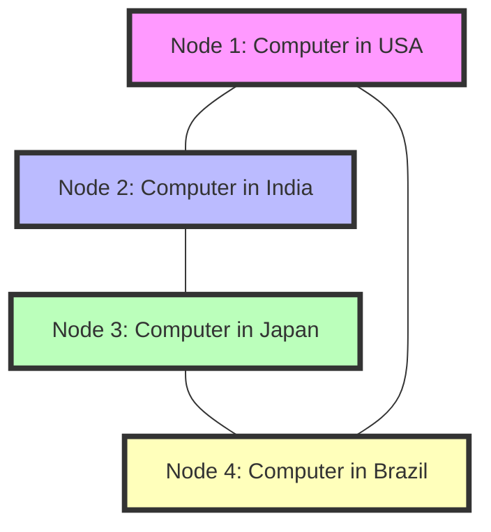
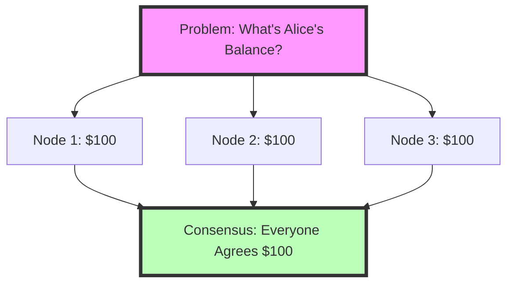
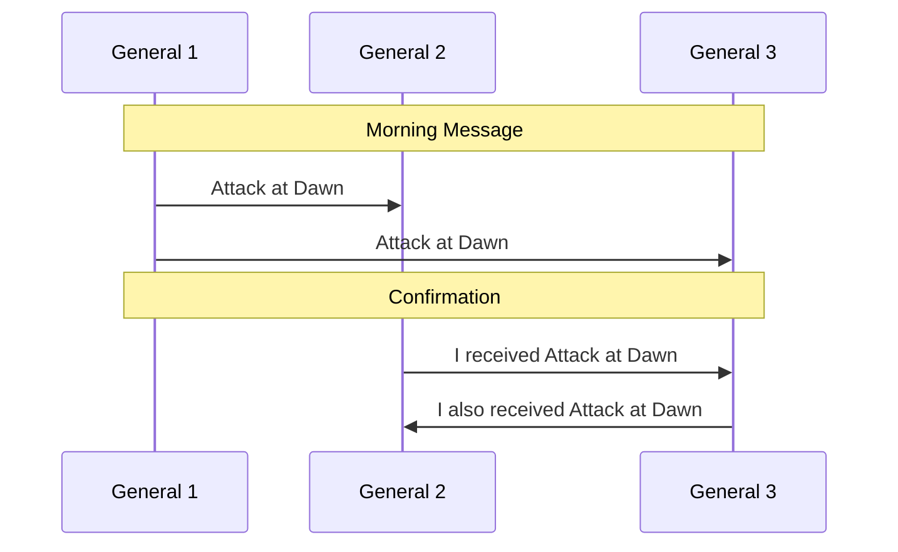
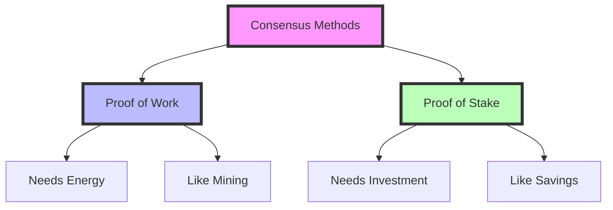

# 🔗 Introduction to Blockchain Consensus
## Unit 1: For Complete Beginners

# Part 1: Basic Terms You Need to Know First 📚

Before we dive into consensus, let's understand some basic terms that we'll be using throughout this course:

## 1.1 Essential Terms

### 🔹 Blockchain
Think of a blockchain like a digital diary that:
- Everyone can see
- Nobody can erase or change past entries
- Multiple people keep identical copies
- New entries must be agreed upon by everyone

Real-world example: Imagine a shared Google Doc where:
- You can only add new content, never delete
- Everyone sees the same thing
- Changes need group approval
- Everything is time-stamped

### 🔹 Node
A node is just a computer in the blockchain network.
- Like a person with a copy of that shared diary
- Can be anywhere in the world
- Helps verify and record new information

Real-world example: Think of nodes like branch offices of a bank:
- Each branch keeps records
- All branches stay synchronized
- Each branch can process transactions



### 🔹 Transaction
A transaction is any information you want to record in the blockchain:
- Could be sending money
- Could be storing information
- Could be any type of record

Real-world example: Like writing a check:
- Has a sender (who's paying)
- Has a receiver (who's getting paid)
- Has an amount
- Has a timestamp

### 🔹 Block
A block is like a page in our digital diary:
- Contains multiple transactions
- Has a timestamp
- Links to the previous block
- Has a unique identifier (hash)

Real-world example: Think of a block like a page in your bank statement:
- Shows multiple transactions
- Has a date
- References previous statement
- Has a unique page number

```python
# Simple example of what a block looks like
class SimpleBlock:
    def __init__(self, transactions, previous_block_number):
        self.transactions = transactions
        self.block_number = previous_block_number + 1
        self.timestamp = time.time()
        
        # Example of use
block = SimpleBlock(
    transactions=["Alice sends $10 to Bob",
                 "Charlie sends $5 to David"],
    previous_block_number=50
)
```

# Part 2: What is Consensus? 🤝

## 2.1 Understanding Consensus in Simple Terms

### What is Consensus?
Consensus is simply the way everyone agrees on what's true.

Real-world examples:
1. **Restaurant Decision**
   - Group of friends deciding where to eat
   - Everyone needs to agree on one place
   - Majority vote might decide

2. **Class Schedule**
   - Teachers and students agreeing on class timing
   - Must work for everyone
   - Final schedule is the consensus

### Why Do We Need Consensus in Blockchain?
Imagine these situations:

1. **Without Consensus:**
   - Alice tells Bob she has $100
   - Alice tells Charlie she has $50
   - Who's right? What's her real balance?

2. **With Consensus:**
   - Alice's balance is verified by everyone
   - All nodes must agree on the amount
   - Everyone has the same information



## 2.2 Types of Consensus Methods

### 1. Proof of Work (PoW)
Think of it like solving a puzzle:
- The first one to solve gets to add the new block
- Like a competition
- Requires computer power

Real-world example: Like a math competition
- Everyone gets the same problem
- First to solve correctly wins
- Can verify the answer easily

### 2. Proof of Stake (PoS)
Like having voting rights based on how much you've invested:
- More stake = more voting power
- Like shareholders in a company
- More eco-friendly than PoW

Real-world example: Like a company board meeting
- Larger shareholders have more voting power
- Must have skin in the game
- Can lose investment if dishonest

```python
# Simple example of stake-based voting
class StakeHolder:
    def __init__(self, name, stake_amount):
        self.name = name
        self.stake = stake_amount
        
    def voting_power(self):
        return self.stake
        
# Example usage
alice = StakeHolder("Alice", 1000)
bob = StakeHolder("Bob", 500)

print(f"Alice's voting power: {alice.voting_power()}")
print(f"Bob's voting power: {bob.voting_power()}")
```

# Part 3: The Byzantine Generals Problem 🗡️

## 3.1 Understanding the Problem with a Simple Story

### The Story
Imagine this situation:
- Several army generals are surrounding a city
- They must ALL attack at the same time to win
- They can only communicate by messenger
- Some generals might be traitors
- How do they agree on when to attack?

### Real-World Examples:
1. **Group Project Communication**
   - Team members in different locations
   - Must coordinate on deadlines
   - Some members might not do their part
   - Need everyone to agree on the plan

2. **Online Gaming**
   - Players in different countries
   - Must agree on game state
   - Some players might cheat
   - Need fair play verification



## 3.2 Simple Code Example to Understand Byzantine Problem

```python
class General:
    def __init__(self, name, is_traitor=False):
        self.name = name
        self.is_traitor = is_traitor
        self.received_orders = []
    
    def send_order(self, original_order):
        if self.is_traitor:
            # Traitor changes the order randomly
            return random.choice(["ATTACK", "RETREAT"])
        else:
            # Loyal general sends true order
            return original_order
    
    def receive_order(self, order, from_general):
        self.received_orders.append({
            "from": from_general,
            "order": order
        })
        
# Example Usage
general1 = General("General 1")
general2 = General("General 2")
general3 = General("General 3", is_traitor=True)

# Simulate message sending
order = "ATTACK"
print(f"Original order: {order}")
print(f"General 1 sends: {general1.send_order(order)}")
print(f"General 2 sends: {general2.send_order(order)}")
print(f"Traitor sends: {general3.send_order(order)}")
```

# Part 4: Nakamoto Consensus Made Simple 🌟

## 4.1 What is Nakamoto Consensus?

Think of it like this:
- Instead of voting, we have a competition
- First to solve a puzzle gets to add new information
- Everyone can easily check if the solution is correct
- Requires actual work (hence "Proof of Work")

### Real-World Analogy: Treasure Hunt
1. Everyone gets the same map (puzzle)
2. First to find treasure (solution) wins
3. Everyone can verify if treasure is real
4. Finding treasure requires effort

## 4.2 How Does It Work?

### Simple Example with Numbers:
```python
import hashlib
import random

def find_lucky_number(target):
    number = 0
    while True:
        # Try a number
        result = hashlib.sha256(str(number).encode()).hexdigest()
        # Check if it's "lucky" (ends with target)
        if result.endswith(target):
            return number
        number += 1

# Example: Find a number that gives a hash ending in "000"
lucky_number = find_lucky_number("000")
print(f"Found lucky number: {lucky_number}")
```

# Part 5: Proof of Work vs Proof of Stake 🔄

## 5.1 Understanding the Difference

### Proof of Work (PoW)
Like a running race:
- Everyone races to solve puzzle
- Fastest runner (solver) wins
- Need lots of energy to run (compute)

Real-world example: Gold mining
- Requires actual work
- First to find gold gets reward
- Expensive equipment needed

### Proof of Stake (PoS)
Like a lottery:
- More tickets = better chance to win
- Tickets = your stake (investment)
- No running (computing) needed

Real-world example: Bank savings
- More savings = more interest
- No physical work required
- Must have money to participate



# Part 6: Practical Exercises for Beginners 💪

## 6.1 Exercise 1: Simple Voting System
```python
class VotingSystem:
    def __init__(self):
        self.votes = {}
        
    def cast_vote(self, voter, choice):
        self.votes[voter] = choice
        
    def count_votes(self):
        results = {}
        for choice in self.votes.values():
            if choice in results:
                results[choice] += 1
            else:
                results[choice] = 1
        return results

# Try it out!
voting = VotingSystem()
voting.cast_vote("Alice", "yes")
voting.cast_vote("Bob", "no")
voting.cast_vote("Charlie", "yes")
print(voting.count_votes())
```

## 6.2 Exercise 2: Simple Blockchain
```python
class SimpleBlock:
    def __init__(self, data, previous_hash):
        self.data = data
        self.previous_hash = previous_hash
        self.timestamp = time.time()
        
class SimpleChain:
    def __init__(self):
        self.chain = [self.create_first_block()]
        
    def create_first_block(self):
        return SimpleBlock("First Block!", "0")
        
    def add_block(self, data):
        previous_block = self.chain[-1]
        new_block = SimpleBlock(data, previous_block.hash)
        self.chain.append(new_block)

# Try it out!
blockchain = SimpleChain()
blockchain.add_block("Alice sends $10 to Bob")
blockchain.add_block("Charlie sends $5 to David")
```

# Key Points to Remember 🎯

1. Consensus = Everyone agreeing on what's true
2. Different ways to reach consensus:
   - Proof of Work (solving puzzles)
   - Proof of Stake (using investment)
3. Byzantine Problem = Dealing with traitors
4. More computing power or stake = More influence

# Review Questions 📝

1. What is consensus and why do we need it?
2. How would you explain Proof of Work to a friend?
3. What's the difference between PoW and PoS?
4. How does the Byzantine Generals Problem relate to blockchain?

Remember: Take your time understanding these concepts. They form the foundation of blockchain technology!