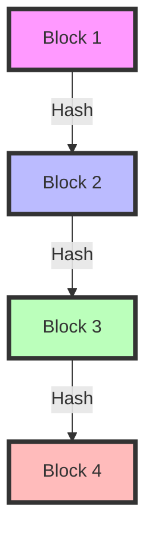

# 🔐 Introduction to Cryptography in Blockchain
## Unit 2: For Complete Beginners

# Part 1: Understanding Cryptography Basics 📚

## 1.1 What is Cryptography?

### Simple Definition
Cryptography is like having a secret code:
- Turns normal messages into scrambled text
- Only the right people can unscramble it
- Keeps information safe and private

### Real-World Examples:
1. **Traditional Letter**
   - Writing a message in secret code
   - Only friend with decoder ring can read it
   
2. **WhatsApp Messages**
   - Messages are scrambled when sent
   - Only sender and receiver can read them


## 1.2 Basic Types of Cryptography

### 1. Symmetric Cryptography (Secret Key)
Like a shared house key:
- Same key locks and unlocks door
- Everyone who needs access must have copy
- Must keep key secret

```python
# Simple example of symmetric encryption
def simple_encrypt(message, key):
    encrypted = ""
    for char in message:
        # Shift each character by key amount
        encrypted += chr(ord(char) + key)
    return encrypted

def simple_decrypt(encrypted_message, key):
    decrypted = ""
    for char in encrypted_message:
        # Shift back each character
        decrypted += chr(ord(char) - key)
    return decrypted

# Try it out!
message = "Hello World"
key = 3
encrypted = simple_encrypt(message, key)
decrypted = simple_decrypt(encrypted, key)

print(f"Original: {message}")
print(f"Encrypted: {encrypted}")
print(f"Decrypted: {decrypted}")
```

### 2. Asymmetric Cryptography (Public & Private Keys)
Like a mailbox:
- Public key = mailbox slot (anyone can put mail in)
- Private key = mailbox key (only you can take mail out)
- Everyone can know public key
- Keep private key secret

# Part 2: Understanding Hashing 🧮

## 2.1 What is Hashing?

### Simple Definition
Hashing is like a fingerprint for digital information:
- Takes any input (big or small)
- Creates fixed-size output
- Cannot be reversed
- Same input always gives same output
- Small change gives completely different output

### Real-World Example:
Like book ISBN numbers:
- Each book has unique number
- Can't get book content from ISBN
- ISBN doesn't reveal book contents
- Different books have different ISBNs

```python
import hashlib

def show_hash_example(text):
    # Create hash of text
    hash_result = hashlib.sha256(text.encode()).hexdigest()
    print(f"Text: {text}")
    print(f"Hash: {hash_result}")
    print("---")

# Try with different texts
show_hash_example("Hello")
show_hash_example("hello")  # Notice completely different hash
show_hash_example("Hello!")  # Even adding ! changes everything
```

## 2.2 Why Hashing is Important in Blockchain

### Use Cases:
1. **Transaction IDs**
   - Each transaction gets unique ID
   - Can't change transaction without changing ID
   
2. **Block Links**
   - Each block contains previous block's hash
   - Creates unbreakable chain
   
3. **Wallet Addresses**
   - Created from public keys
   - Shorter and easier to use



# Part 3: Digital Signatures 📝

## 3.1 Understanding Digital Signatures

### Simple Explanation
Like a handwritten signature but digital:
- Proves you sent the message
- Proves message wasn't changed
- Can't be copied or reused
- Uses your private key

### Real-World Analogy:
Like signing a check:
- Only you can sign it
- Bank can verify your signature
- Changed check becomes invalid
- Each check signed separately

```python
class SimpleSigner:
    def __init__(self):
        # In real world, these would be complex keys
        self.private_key = "secret123"
        self.public_key = "public456"
    
    def sign_message(self, message):
        # Simple simulation of signing
        signature = f"{message}-signed-with-{self.private_key}"
        return signature
    
    def verify_signature(self, message, signature):
        # Simple simulation of verification
        expected = f"{message}-signed-with-{self.private_key}"
        return signature == expected

# Try it out!
signer = SimpleSigner()
message = "Send 1 Bitcoin to Bob"
signature = signer.sign_message(message)
is_valid = signer.verify_signature(message, signature)
print(f"Signature valid? {is_valid}")
```

# Part 4: Elliptic Curve Cryptography (ECC) 🔄

## 4.1 Simple Introduction to ECC

### What is ECC?
- Special type of math using curves
- More secure than traditional methods
- Uses less computer power
- Used in Bitcoin and other cryptocurrencies

### Simple Analogy:
Like mixing paint:
- Easy to mix colors
- Hard to separate mixed colors
- Similarly, ECC operations are:
  - Easy in one direction
  - Very hard to reverse

```python
# Simplified representation of a point on elliptic curve
class ECPoint:
    def __init__(self, x, y):
        self.x = x
        self.y = y
    
    def __str__(self):
        return f"Point({self.x}, {self.y})"

# Example point
point = ECPoint(5, 7)
print(f"A point on the curve: {point}")
```

# Part 5: Practical Examples 💻

## 5.1 Creating a Simple Wallet

```python
import hashlib
import random

class SimpleWallet:
    def __init__(self):
        # Create "private key" (just a random number in this example)
        self.private_key = random.randint(1, 1000000)
        # Create "public key" (hash of private key)
        self.public_key = hashlib.sha256(
            str(self.private_key).encode()
        ).hexdigest()
        # Create wallet address (short version of public key)
        self.address = self.public_key[:10]
    
    def show_details(self):
        print(f"Private Key: {self.private_key} (keep secret!)")
        print(f"Public Key: {self.public_key}")
        print(f"Wallet Address: {self.address}")

# Create a wallet
my_wallet = SimpleWallet()
my_wallet.show_details()
```

## 5.2 Simple Transaction Signing

```python
class SimpleTransaction:
    def __init__(self, from_address, to_address, amount):
        self.from_address = from_address
        self.to_address = to_address
        self.amount = amount
        
    def create_signature(self, private_key):
        # Simple signature creation
        transaction_data = f"{self.from_address}{self.to_address}{self.amount}"
        signature = hashlib.sha256(
            (transaction_data + str(private_key)).encode()
        ).hexdigest()
        return signature

# Try it out!
transaction = SimpleTransaction("Alice", "Bob", 100)
signature = transaction.create_signature(12345)  # Private key
print(f"Transaction signature: {signature}")
```

# Review Questions 📝

1. What is cryptography and why do we need it in blockchain?
2. How is hashing different from encryption?
3. What's the difference between public and private keys?
4. Why are digital signatures important?

# Exercises to Try 💪

1. Create different hashes:
   - Try hashing your name
   - Add a number to it
   - See how hashes change

2. Simple Encryption:
   - Use the provided simple encryption code
   - Try different messages and keys
   - What happens with very long messages?

3. Wallet Creation:
   - Create multiple wallets
   - Compare their addresses
   - Try to understand why each is unique

Remember: Cryptography is complex, but understanding these basics will help you grasp how blockchain keeps information secure!