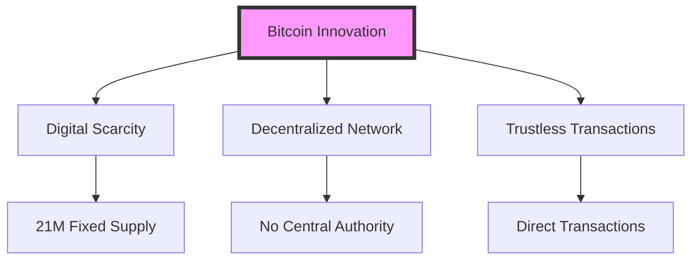
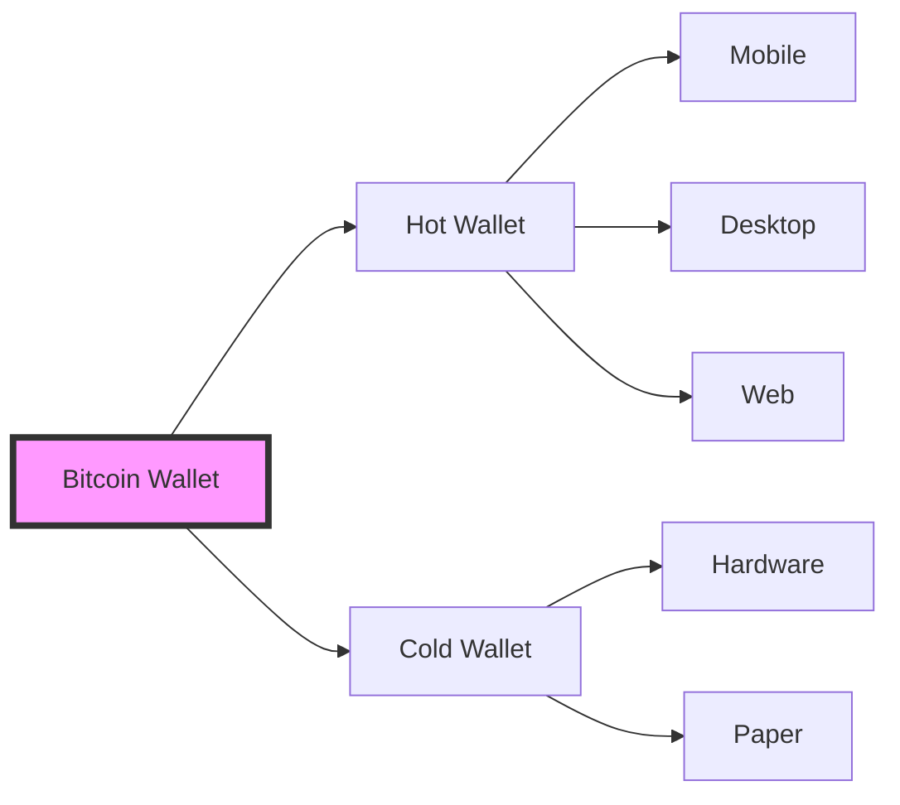
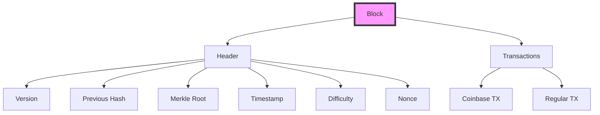
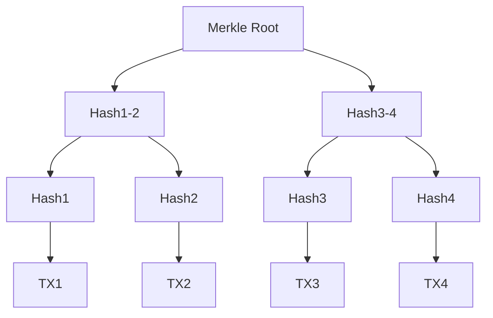
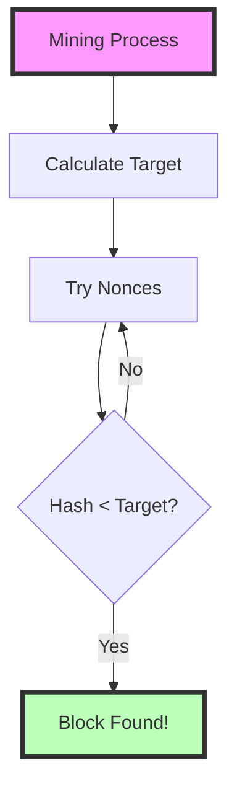
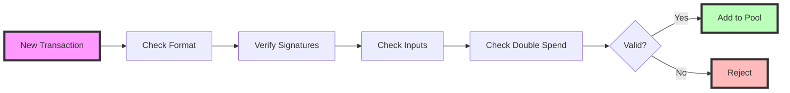
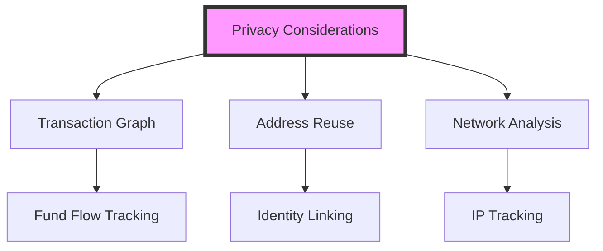
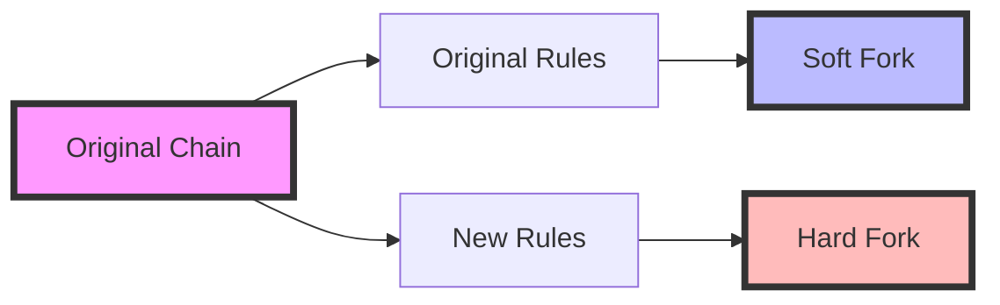
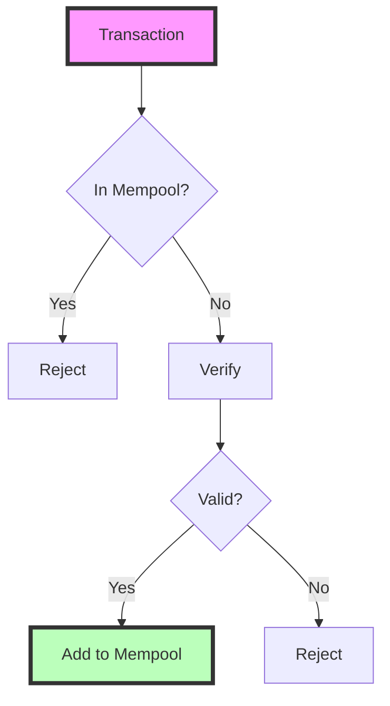

# UNIT III: BITCOIN
## Understanding the First Cryptocurrency

# 1. Introduction to Bitcoin 🌟

## 1.1 Historical Context

Bitcoin emerged in 2008 when a person or group using the pseudonym Satoshi Nakamoto published the Bitcoin whitepaper "Bitcoin: A Peer-to-Peer Electronic Cash System". The first Bitcoin block (Genesis Block) was mined on January 3, 2009.

### Key Milestones:
- 2008: Bitcoin whitepaper published
- 2009: First Bitcoin transaction
- 2010: First real-world transaction (Bitcoin Pizza Day)
- 2011: Bitcoin reaches price parity with USD
- 2017: Bitcoin gains mainstream attention
- 2021: Bitcoin becomes legal tender in El Salvador

## 1.2 Fundamental Concepts

Bitcoin represents three important innovations:
1. **Digital Scarcity**: Only 21 million bitcoins will ever exist
2. **Decentralized Network**: No central authority controls the system
3. **Trustless Transactions**: No need to trust intermediaries



## 1.3 How Bitcoin Works: Simple Example

```python
import hashlib
import time

def create_simple_transaction(sender, receiver, amount):
    """Create a simple Bitcoin transaction"""
    transaction = {
        'sender': sender,
        'receiver': receiver,
        'amount': amount,
        'timestamp': time.time()
    }
    # Create transaction hash
    tx_string = f"{sender}{receiver}{amount}{time.time()}"
    transaction['hash'] = hashlib.sha256(tx_string.encode()).hexdigest()
    return transaction

# Example usage
tx = create_simple_transaction("Alice", "Bob", 1.5)
print("\nBitcoin Transaction Example:")
for key, value in tx.items():
    print(f"{key}: {value}")
```

# 2. Bitcoin Wallets 👛

## 2.1 Understanding Wallets

A Bitcoin wallet is not like a traditional wallet that stores money. Instead, it stores:
- Private Keys (like your secret password)
- Public Keys (like your email address)
- Bitcoin Addresses (like your bank account number)

### Types of Wallets:

1. **Hot Wallets**
   - Connected to internet
   - Mobile apps, desktop software
   - Convenient but less secure
   
2. **Cold Wallets**
   - Offline storage
   - Hardware devices, paper wallets
   - Very secure but less convenient



## 2.2 Creating a Simple Wallet

```python
import hashlib
import random

class SimpleWallet:
    def __init__(self, owner_name):
        self.owner = owner_name
        self.private_key = self.generate_private_key()
        self.public_key = self.generate_public_key()
        self.address = self.generate_address()
    
    def generate_private_key(self):
        """Generate a random private key"""
        return ''.join(random.choices('0123456789abcdef', k=32))
    
    def generate_public_key(self):
        """Derive public key from private key (simplified)"""
        return hashlib.sha256(self.private_key.encode()).hexdigest()
    
    def generate_address(self):
        """Create Bitcoin address (simplified)"""
        return 'bc1' + self.public_key[:20]

# Create and show a wallet
wallet = SimpleWallet("Alice")
print("\nWallet Components:")
print(f"Private Key: {wallet.private_key}")
print(f"Public Key: {wallet.public_key}")
print(f"Address: {wallet.address}")
```

# 3. Understanding Blocks 🧱

## 3.1 Block Structure

A Bitcoin block is like a container that holds:
1. Block Header
   - Version number
   - Previous block hash
   - Merkle root
   - Timestamp
   - Difficulty target
   - Nonce

2. Transaction List
   - Coinbase transaction (mining reward)
   - User transactions

### Visual Block Structure:


## 3.2 Simple Block Implementation

```python
class SimpleBlock:
    def __init__(self, previous_hash, transactions):
        self.previous_hash = previous_hash
        self.transactions = transactions
        self.timestamp = time.time()
        self.nonce = 0
        self.hash = self.calculate_hash()
    
    def calculate_hash(self):
        block_content = f"{self.previous_hash}{self.transactions}{self.timestamp}{self.nonce}"
        return hashlib.sha256(block_content.encode()).hexdigest()

# Create a simple block
transactions = ["Alice → Bob: 5 BTC", "Charlie → David: 2.5 BTC"]
block = SimpleBlock("0000000000000000", transactions)
print(f"\nBlock Hash: {block.hash}")
```

# 4. Merkle Trees 🌳

## 4.1 Understanding Merkle Trees

A Merkle tree is a binary tree of hashes that allows efficient verification of block contents. It:
- Provides a single hash (root) to represent all transactions
- Enables quick verification of transaction inclusion
- Supports Simple Payment Verification (SPV)

### How Merkle Trees Work:

1. Hash all transactions individually
2. Pair hashes and hash them together
3. Repeat until single hash remains (Merkle Root)
4. Store root in block header



# 5. Hardness of Mining ⛏️

## 5.1 Understanding Mining Difficulty

Mining difficulty is a dynamic measure that ensures blocks are found approximately every 10 minutes, regardless of total network computing power.

### Key Concepts:

1. **Target Hash**
   - Must be below a certain value
   - More leading zeros = harder to find
   - Adjusts every 2016 blocks (~2 weeks)

2. **Difficulty Calculation**
```
New Difficulty = Current Difficulty × (Actual Time / Expected Time)
Expected Time = 2016 blocks × 10 minutes = 20160 minutes
```



### Simple Mining Example:
```python
import hashlib
import time

def mine_block(data, difficulty):
    nonce = 0
    target = '0' * difficulty
    start_time = time.time()
    
    while True:
        block = f"{data}{nonce}"
        hash_result = hashlib.sha256(block.encode()).hexdigest()
        
        if hash_result.startswith(target):
            end_time = time.time()
            return {
                'nonce': nonce,
                'hash': hash_result,
                'time_taken': end_time - start_time
            }
        nonce += 1

# Try mining with increasing difficulty
for diff in range(1, 5):
    print(f"\nMining with difficulty {diff}...")
    result = mine_block("Bitcoin Block", diff)
    print(f"Nonce found: {result['nonce']}")
    print(f"Hash: {result['hash']}")
    print(f"Time taken: {result['time_taken']:.2f} seconds")
```

# 6. Transaction Verifiability ✅

## 6.1 Transaction Verification Process

Every Bitcoin transaction must be verified for:
1. Valid digital signatures
2. Sufficient input amounts
3. No double spending
4. Correct transaction format

### Verification Steps:


### Simple Transaction Verification:
```python
class Transaction:
    def __init__(self, sender, recipient, amount, signature=None):
        self.sender = sender
        self.recipient = recipient
        self.amount = amount
        self.signature = signature
    
    def verify(self, public_key):
        """Simple verification demo"""
        # Check format
        if not all([self.sender, self.recipient, self.amount]):
            return False, "Invalid format"
        
        # Check amount
        if self.amount <= 0:
            return False, "Invalid amount"
        
        # Check signature (simplified)
        if not self.signature:
            return False, "Missing signature"
            
        return True, "Transaction valid"

# Test verification
tx = Transaction("Alice", "Bob", 5.0, "valid_signature")
is_valid, message = tx.verify("alice_public_key")
print(f"\nTransaction Verification: {message}")
```

# 7. Bitcoin Anonymity 🕵️

## 7.1 Understanding Bitcoin Privacy

Bitcoin is pseudonymous, not anonymous:
- Addresses are pseudonyms
- All transactions are public
- Identity can be linked through analysis

### Privacy Challenges:

1. **Transaction Graph**
   - Shows flow of funds
   - Can reveal patterns
   - Links addresses together

2. **Address Reuse**
   - Makes tracking easier
   - Should use new address each time
   - Change addresses help privacy



# 8. Bitcoin Forks 🍴

## 8.1 Types of Forks

### Soft Forks
- Backward compatible
- Old nodes still work
- Tighter rules added

### Hard Forks
- Not backward compatible
- Creates new chain
- Requires all nodes to upgrade



### Fork Simulation:
```python
class Blockchain:
    def __init__(self, name):
        self.name = name
        self.chain = []
        
    def add_block(self, data, rules_version):
        block = {
            'data': data,
            'rules_version': rules_version,
            'previous_hash': self.chain[-1]['hash'] if self.chain else '0'
        }
        self.chain.append(block)
        print(f"{self.name}: Added block with rules v{rules_version}")

# Simulate fork
main_chain = Blockchain("Main Chain")
fork_chain = Blockchain("Fork Chain")

# Add blocks
main_chain.add_block("Block 1", 1)
main_chain.add_block("Block 2", 1)
fork_chain.add_block("Block 1", 2)  # New rules
```

# 9. Double Spending Prevention 🔒

## 9.1 Understanding Double Spending

Double spending is attempting to spend the same bitcoins multiple times. Bitcoin prevents this through:
1. Transaction verification
2. Network propagation
3. Block confirmation



### Simple Double Spend Check:
```python
class TransactionPool:
    def __init__(self):
        self.transactions = set()
    
    def add_transaction(self, tx_hash):
        if tx_hash in self.transactions:
            return False, "Double spend detected!"
        self.transactions.add(tx_hash)
        return True, "Transaction accepted"

# Test double spending
pool = TransactionPool()
tx1 = "transaction_hash_123"
tx2 = "transaction_hash_123"  # Same hash (double spend attempt)

print("\nAttempting first transaction...")
print(pool.add_transaction(tx1))
print("\nAttempting double spend...")
print(pool.add_transaction(tx2))
```

# 10. Mathematical Analysis of Bitcoin Properties 📊

## 10.1 Key Properties

1. **Probabilistic Finality**
   - Probability of reversal decreases exponentially with confirmations
   - After 6 confirmations, reversal probability is negligible

2. **Network Security**
   - Requires 51% of hash power for attack
   - Cost of attack increases with network size

### Security Formula:
```
P(attack) = 1 - (1-q)^z
where:
q = attacker's hash power ratio
z = number of confirmations
```

This completes our comprehensive look at Bitcoin's core concepts and implementation details. Each section provides both theoretical understanding and practical demonstrations through code.