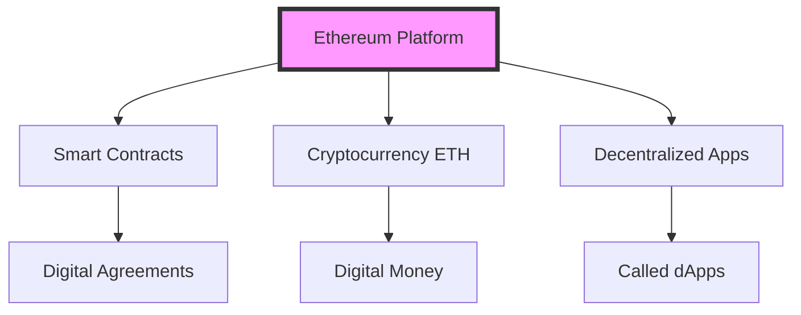
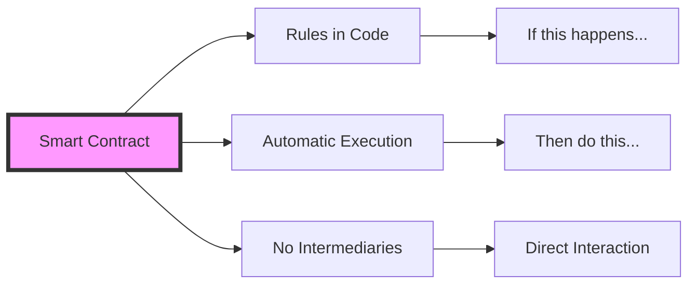
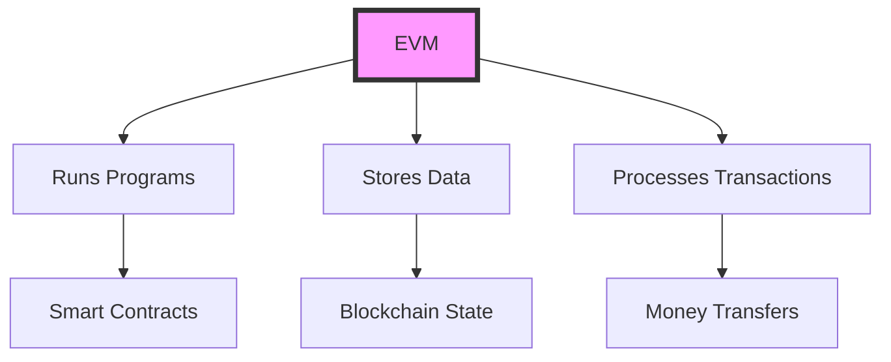
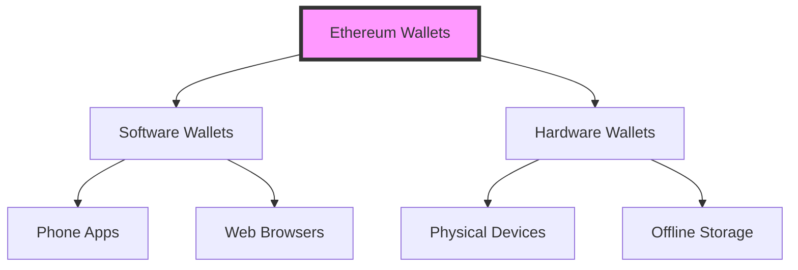
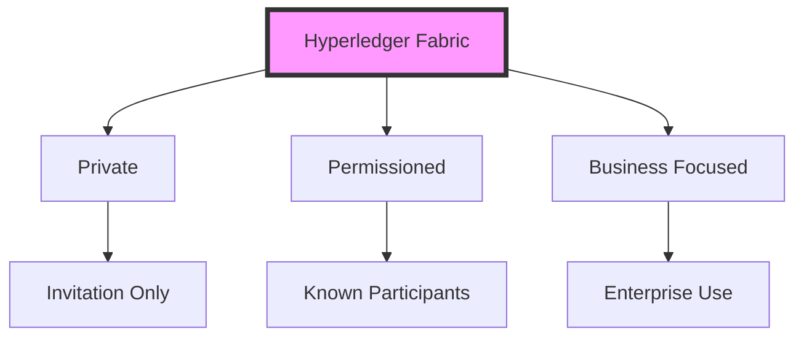
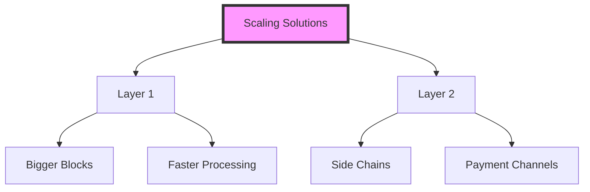

# UNIT IV: ETHEREUM
## Understanding the Next Generation Blockchain

# 1. Introduction to Ethereum 🌟

## 1.1 What is Ethereum?
Unlike Bitcoin which focuses mainly on digital money, Ethereum is a platform that lets you run programs on a blockchain. Think of it as:
- A world computer that anyone can use
- A platform for running applications that can't be shut down
- A system for creating and running smart contracts

### Real-World Analogy:
Think of Ethereum like a smartphone:
- Apps can run on it (these are like smart contracts)
- Has its own currency (ETH, like how your phone might have Apple Pay)
- Anyone can create apps for it (like how developers make smartphone apps)



# 2. Understanding Smart Contracts 📝

## 2.1 What is a Smart Contract?

### Simple Explanation:
A smart contract is like a vending machine:
- It has rules programmed into it
- It automatically executes when conditions are met
- You don't need to trust a person to run it
- It works the same way every time

### Real-World Example:
Think of buying a house:
1. **Traditional Way:**
   - Need lawyers
   - Lots of paperwork
   - Takes days or weeks
   - Requires trust in multiple parties

2. **Smart Contract Way:**
   - Rules are in code
   - Executes automatically
   - Takes minutes
   - No need for intermediaries



## 2.2 Simple Smart Contract Example:
```solidity
// This is a very basic smart contract
contract SimpleStorage {
    // Think of this like a box that can store a number
    uint public myNumber;
    
    // This function puts a number in the box
    function storeNumber(uint num) public {
        myNumber = num;
    }
    
    // This function lets you look at the number in the box
    function retrieveNumber() public view returns (uint) {
        return myNumber;
    }
}
```

# 3. Ethereum Virtual Machine (EVM) 🖥️

## 3.1 What is the EVM?

### Simple Explanation:
The EVM is like a giant global computer that:
- Runs on thousands of computers worldwide
- Never stops working
- Executes smart contracts
- Keeps everything synchronized

### Real-World Analogy:
Think of the EVM like a calculator:
- Gives the same result no matter who uses it
- Works step by step
- Everyone agrees on the results
- Can't be tampered with



## 3.2 How the EVM Works:
```python
# Simple demonstration of how EVM processes instructions
class SimpleEVM:
    def __init__(self):
        self.storage = {}  # Like EVM's permanent storage
        self.memory = []   # Like EVM's temporary memory
        
    def store_value(self, location, value):
        """Store a value (like a smart contract storing data)"""
        self.storage[location] = value
        print(f"Stored {value} at location {location}")
        
    def get_value(self, location):
        """Get a value (like a smart contract reading data)"""
        return self.storage.get(location, "No value stored")

# Let's try using our simple EVM
evm = SimpleEVM()
evm.store_value("name", "Alice")
print(f"Retrieved: {evm.get_value('name')}")
```

# 4. Ethereum Wallets 👛

## 4.1 What is an Ethereum Wallet?

### Simple Explanation:
An Ethereum wallet is like a combination of:
- Your email address (public address)
- Your password (private key)
- Your bank account (holds your ETH)

### Types of Wallets:

1. **Software Wallets**
   - Like apps on your phone
   - Example: MetaMask
   - Easy to use but less secure

2. **Hardware Wallets**
   - Like a special USB stick
   - Example: Ledger
   - Very secure but costs money



# 5. Programming in Solidity 💻

## 5.1 What is Solidity?

### Simple Explanation:
Solidity is like a recipe book for smart contracts:
- It's a programming language
- Made specifically for Ethereum
- Used to write smart contracts
- Similar to JavaScript if you know it

### Basic Concepts:

1. **Variables** (like boxes to store things):
```solidity
// Store a number
uint myNumber = 42;

// Store some text
string myText = "Hello";

// Store an address (like an email address for Ethereum)
address myAddress = 0x123...;
```

2. **Functions** (like instructions in a recipe):
```solidity
// A very simple function
function add(uint a, uint b) public pure returns (uint) {
    return a + b;
}
```

## 5.2 Your First Smart Contract:
```solidity
// SPDX-License-Identifier: MIT
pragma solidity ^0.8.0;

// This is like a digital piggy bank
contract PiggyBank {
    // The owner of the piggy bank
    address public owner;
    
    // How much money is in the piggy bank
    uint public savings;
    
    // When we create the piggy bank, set who owns it
    constructor() {
        owner = msg.sender;
        savings = 0;
    }
    
    // Put money in the piggy bank
    function deposit() public payable {
        savings += msg.value;
    }
    
    // Break the piggy bank and get all the money
    // Only the owner can do this!
    function break() public {
        require(msg.sender == owner, "Only the owner can break the piggy bank!");
        payable(owner).transfer(address(this).balance);
    }
}
```

# 6. Smart Contract Security 🔒

## 6.1 What Can Go Wrong?

Think of smart contracts like digital vending machines:
- They hold real money
- Anyone can try to use them
- If there's a flaw, money could be lost
- Once deployed, they can't be easily changed

### Common Problems:

1. **The Unlocked Door Problem**
```solidity
// Bad example - anyone can take the money!
contract UnsafeBank {
    function withdraw() public {
        // Sends money to whoever called this function
        payable(msg.sender).transfer(address(this).balance);
    }
}

// Better example - only owner can withdraw
contract SafeBank {
    address owner;
    
    constructor() {
        owner = msg.sender;
    }
    
    function withdraw() public {
        require(msg.sender == owner, "Only owner can withdraw!");
        payable(owner).transfer(address(this).balance);
    }
}
```

2. **The Race Condition Problem**
Like when two people try to take the last cookie at the same time:
```solidity
// Bad example - vulnerable to "reentrancy" attacks
contract UnsafeWithdraw {
    mapping(address => uint) balances;
    
    function withdraw() public {
        uint amount = balances[msg.sender];
        // Problem: This sends money before reducing the balance!
        (bool success,) = msg.sender.call{value: amount}("");
        require(success);
        balances[msg.sender] = 0;
    }
}

// Better example - safe from reentrancy
contract SafeWithdraw {
    mapping(address => uint) balances;
    
    function withdraw() public {
        uint amount = balances[msg.sender];
        // Fix: Update balance before sending money
        balances[msg.sender] = 0;
        (bool success,) = msg.sender.call{value: amount}("");
        require(success);
    }
}
```

# 7. Hyperledger Fabric 🏗️

## 7.1 What is Hyperledger Fabric?

### Simple Explanation:
Think of Hyperledger Fabric like a private blockchain for businesses:
- Only invited members can join
- Like a private club vs. public park
- More controlled than public blockchains
- Faster and more efficient

### Real-World Analogy:
1. **Public Blockchain (like Ethereum)**
   - Like posting on social media
   - Everyone can see
   - Anyone can participate

2. **Hyperledger Fabric**
   - Like a private company network
   - Only employees can access
   - Controlled environment



# 8. Scaling the Blockchain ⚡

## 8.1 What is Scaling?

### Simple Explanation:
Imagine a highway:
- More cars = traffic jams
- Need more lanes = scaling
- Or better traffic systems = optimization

### Real-World Analogy:
Think of it like a restaurant:
1. **Current Blockchain:**
   - Like a small restaurant
   - Limited seats
   - Long wait times
   - Expensive during busy times

2. **Scaled Blockchain:**
   - Like a big restaurant
   - More tables
   - Faster service
   - Reasonable prices



## 8.2 Simple Scaling Example:
```python
class SimpleBlockchain:
    def __init__(self, transactions_per_block):
        self.transactions_per_block = transactions_per_block
        self.pending_transactions = []
        self.blocks = []
    
    def add_transaction(self, tx):
        """Add a new transaction"""
        self.pending_transactions.append(tx)
        
        # If we have enough transactions, create a block
        if len(self.pending_transactions) >= self.transactions_per_block:
            self.create_block()
    
    def create_block(self):
        """Create a new block with pending transactions"""
        new_block = {
            'transactions': self.pending_transactions[:self.transactions_per_block],
            'block_number': len(self.blocks) + 1
        }
        self.blocks.append(new_block)
        self.pending_transactions = self.pending_transactions[self.transactions_per_block:]
        print(f"Created block {new_block['block_number']} with {self.transactions_per_block} transactions")

# Demo with different scaling parameters
print("Small blocks (like current Ethereum):")
small_chain = SimpleBlockchain(3)
for i in range(10):
    small_chain.add_transaction(f"TX_{i}")

print("\nBigger blocks (scaled version):")
big_chain = SimpleBlockchain(5)
for i in range(10):
    big_chain.add_transaction(f"TX_{i}")
```

Remember: Blockchain technology is still evolving. These concepts will grow and change as new solutions are developed!