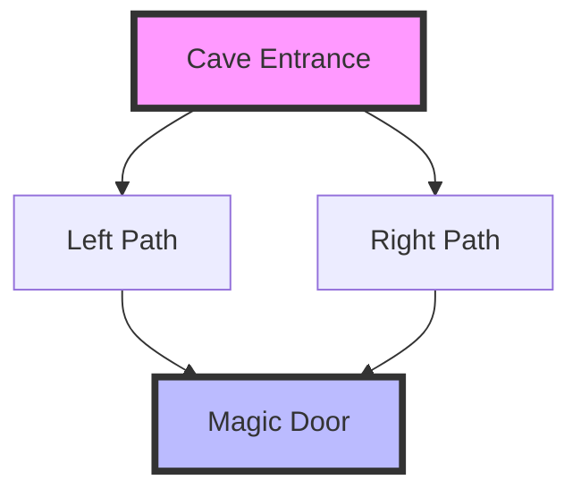
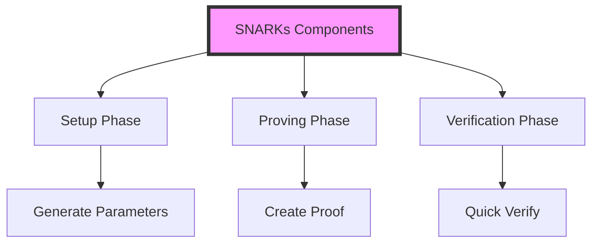
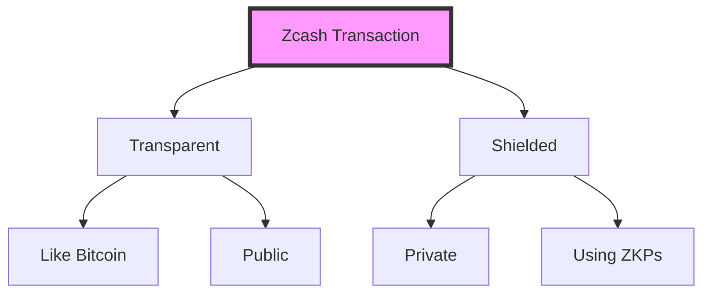
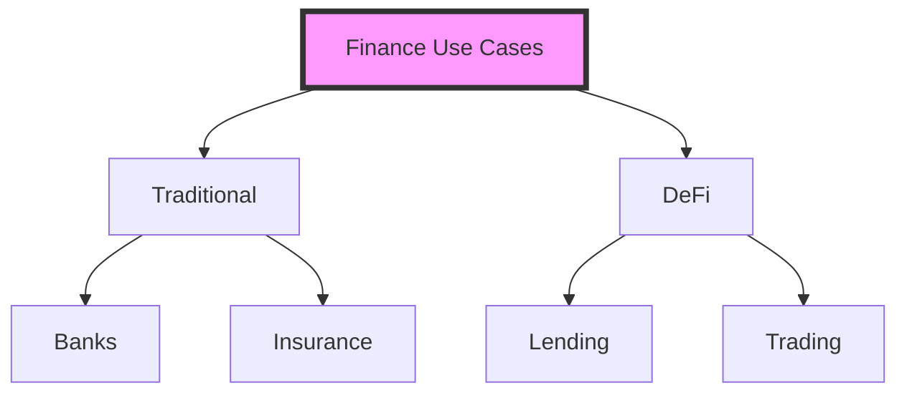
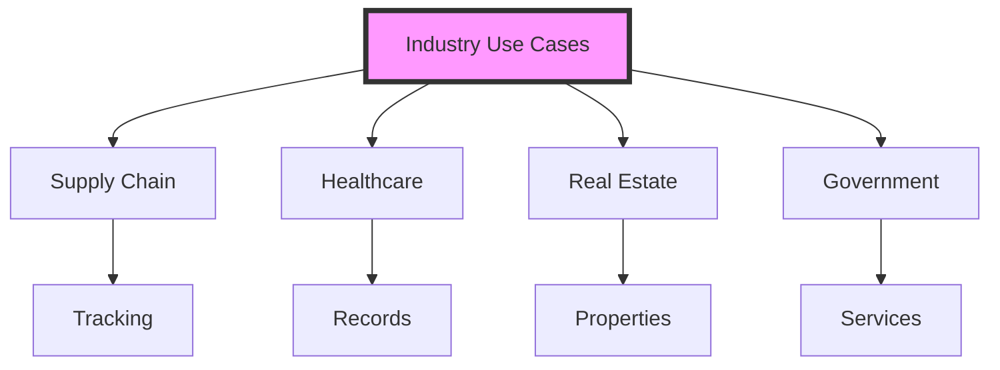

# UNIT V: TRENDS AND TOPICS IN BLOCKCHAIN
## Understanding Advanced Blockchain Concepts

# 1. Zero Knowledge Proofs (ZKP) 🔐

## 1.1 What are Zero Knowledge Proofs?

### Simple Explanation:
Zero Knowledge Proofs are like proving you know a secret without revealing the secret itself.

### Real-World Analogy: The Cave Story
Imagine a circular cave with a magic door in the middle:
- Alice wants to prove to Bob she knows the password to open the door
- She doesn't want to tell Bob the password
- Bob wants to be sure Alice knows the password

Solution:
1. Bob stays at the entrance
2. Alice goes into the cave (left or right)
3. Bob calls out which way she should come back
4. If Alice knows the password, she can always come back the right way



### Key Properties of Zero Knowledge Proofs:
1. **Completeness**: If true, honest prover can convince verifier
2. **Soundness**: False prover can't convince verifier
3. **Zero-Knowledge**: Verifier learns nothing except the proof's validity

## 1.2 Simple ZKP Example:
```python
import random
import hashlib

class SimpleZKP:
    def __init__(self):
        # Secret number (like password)
        self.secret = 42
        # Hash of secret (public commitment)
        self.public_hash = self.hash_number(self.secret)
    
    def hash_number(self, number):
        """Create hash of a number"""
        return hashlib.sha256(str(number).encode()).hexdigest()
    
    def prove_knowledge(self):
        """Prove we know the secret without revealing it"""
        # Create a random number
        r = random.randint(1, 1000)
        # Create commitment
        commitment = self.hash_number(r)
        
        print("\nProver: I know the secret!")
        print(f"Prover: Here's my commitment: {commitment[:10]}...")
        
        # Verifier's challenge (simplified)
        challenge = random.choice([0, 1])
        print(f"\nVerifier: My challenge is: {challenge}")
        
        # Response based on challenge
        if challenge == 0:
            response = r
            print(f"Prover: Response is: {response}")
            # Verifier checks commitment
            assert self.hash_number(response) == commitment
        else:
            response = (r + self.secret) % 1000
            print(f"Prover: Response is: {response}")
            # Verifier checks response
        
        print("Verifier: Proof verified!")

# Let's try our simple ZKP
zkp = SimpleZKP()
zkp.prove_knowledge()
```

# 2. SNARKs (Succinct Non-interactive ARguments of Knowledge) 📜

## 2.1 What are SNARKs?

### Simple Explanation:
SNARKs are like a super-efficient way to prove something is true:
- Succinct: Proof is small and quick to verify
- Non-interactive: No back-and-forth needed
- Arguments: Computationally sound
- Knowledge: Proves you know something

### Real-World Analogy:
Think of a math test:
1. **Traditional Proof**:
   - Show all your work
   - Teacher checks every step
   - Takes long time to verify

2. **SNARK**:
   - Show only the crucial parts
   - Quick to check
   - Still proves you did the work



# 3. Elliptic Curves and Pairing 📐

## 3.1 Understanding Elliptic Curves

### Simple Explanation:
Elliptic curves are special mathematical curves used in cryptography. Think of them like:
- A twisted loop on a graph
- Points that follow special rules
- Used for secure calculations

### Visual Representation:
```python
import numpy as np
import matplotlib.pyplot as plt

def simple_elliptic_curve(a, b):
    """Draw a simple elliptic curve y² = x³ + ax + b"""
    x = np.linspace(-3, 3, 1000)
    y = np.sqrt(np.maximum(x**3 + a*x + b, 0))
    
    plt.figure(figsize=(8, 6))
    plt.plot(x, y, 'b-', label='y² = x³ + ax + b')
    plt.plot(x, -y, 'b-')
    plt.grid(True)
    plt.title('Simple Elliptic Curve')
    plt.axis('equal')
    plt.show()

# Example curve
a = 0
b = 1
simple_elliptic_curve(a, b)
```

# 4. Zcash: Privacy in Practice 🕵️

## 4.1 What is Zcash?

### Simple Explanation:
Zcash is like Bitcoin with a privacy option:
- Can send money privately
- Uses zero-knowledge proofs
- Hides transaction details

### How it Works:
1. **Transparent Addresses** (like Bitcoin):
   - Everyone can see transactions
   - Starts with "t"

2. **Shielded Addresses** (private):
   - Details are hidden
   - Starts with "z"
   - Uses zk-SNARKs



# 5. Blockchain Use Cases 🌐

## 5.1 Finance Applications

### 1. Banking
- Cross-border payments
- Settlement systems
- Trade finance

### 2. DeFi (Decentralized Finance)
- Lending platforms
- Decentralized exchanges
- Yield farming



## 5.2 Industry Applications

### 1. Supply Chain
```python
class SimpleSupplyChain:
    def __init__(self):
        self.chain = []
    
    def add_product(self, product_id, location, status):
        """Track a product in supply chain"""
        self.chain.append({
            'timestamp': time.time(),
            'product_id': product_id,
            'location': location,
            'status': status
        })
        print(f"Product {product_id} tracked at {location}: {status}")
    
    def trace_product(self, product_id):
        """Get product history"""
        history = [event for event in self.chain 
                  if event['product_id'] == product_id]
        return history

# Demo supply chain tracking
supply_chain = SimpleSupplyChain()
supply_chain.add_product("ABC123", "Factory", "Manufactured")
supply_chain.add_product("ABC123", "Warehouse", "Stored")
supply_chain.add_product("ABC123", "Store", "For Sale")
```

### 2. Other Industries
1. **Healthcare**
   - Medical records
   - Drug traceability
   - Insurance claims

2. **Real Estate**
   - Property records
   - Smart contracts for rent
   - Automated payments

3. **Government**
   - Voting systems
   - Identity management
   - Public records



# Key Takeaways 📝

1. Zero Knowledge Proofs enable privacy while maintaining trust
2. SNARKs make complex proofs efficient
3. Elliptic curves provide cryptographic security
4. Zcash demonstrates privacy in practice
5. Blockchain has diverse real-world applications

Remember: These technologies are evolving rapidly. The fundamentals we learned help understand future developments!